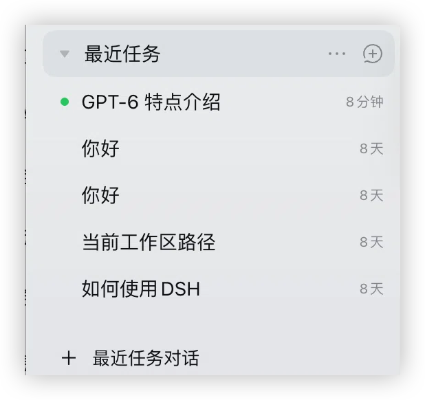

# dsh-recent-tasks

English | [中文](README.zh.md)

[](LICENSE)
[](package.json)
[](https://github.com/deepseek-ai/deepseek-harness)

An always-last, collapsible **「最近任务」/ Recent tasks** workspace group in the DeepSeek Harness sidebar. Chats that have no workspace land there instead of piling up in **未分组** — and because the group is a *real* workspace record rather than a look-alike drawn by a plugin, a chat started from it genuinely belongs to it.

DSH groups every chat under the workspace its session `cwd` resolves to. A chat started without a workspace gets no group at all, so it falls into the `未分组` bucket together with archived folders and deleted projects. This plugin registers **one real workspace record** for a dedicated folder and keeps it at the end of the workspace list: "no workspace" becomes an ordinary group with ordinary behaviour — collapse, expand, rename, drag order, pin, archive, search.

| Piece | What it is |
|---|---|
| Group | A genuine `workspace` record for `<recentTasksDir>`, registered through `ctx.workspaceRegistry` and re-pinned to the end of the durable order |
| Entry | `＋ 最近任务对话` beside Settings at the sidebar foot, plus the `Mod+Alt+N` / `Mod+Shift+N` shortcut — both start a session in that workspace |
| Settings | `最近任务` rows inside **Settings → General** — folder, group name, pin-last, auto-repair — backed by this plugin's official live config |
| Host API | `POST /dsh-recent-tasks/api/state` and `/ensure`, read-only and idempotent; the only write path is the official settings form |

## Screenshots

<p align="center">
  
</p>

The group sits at the end of the workspace list and behaves like any other: `GPT-6 特点介绍` is the chat that is running right now, older ones show how long ago they were used, and `＋ 最近任务对话` at the sidebar foot starts a new chat in that folder.

## Why a real workspace record

The alternative — a plugin-drawn group — cannot work: the sidebar's groups *are* the `workspace` storage domain, and no slot lets a third-party plugin insert a parallel group. Registering a record instead of shadowing the sidebar means:

- sessions started there are normal sessions whose `cwd` is the recent-tasks folder, so the group's `sessionIds` fills itself through the official path (`Workspace.sessionIds` is filtered by `realpath(cwd) === path`, which also makes it impossible for a chat to be dragged into another group);
- the file-access boundary is unchanged: the session's sandbox root is that folder, and escalation inside the chat works exactly as in a workspace chat (design §8.7);
- nothing official is patched, no `workspace` locale string is touched, and 未分组 keeps working untouched; the plugin's own group name is kept in the active language by renaming *its own* record, never the built-in namespace and never another group.

## Requirements

- [DSH](https://github.com/deepseek-ai/deepseek-harness) with a `web` or `desktop` profile, `0.2.0-rc.1` or newer (developed and verified on `0.2.0-rc.2`, cordis `~4.0.4`)
- Node.js `>= 22.19.0` — only to build from source
- [pnpm](https://pnpm.io) is recommended when installing into a profile
- No network access, no native modules, no install scripts, no runtime dependencies

## Install

> The bundle entry (`id: recent-tasks`) is self-declared by this package's `cordis.patch.yml` — no manual patch file is needed.

### From GitHub (recommended)

Install by **repository identity**, so the plugin market can match this package to `winditer/dsh-recent-tasks` unambiguously and show the right GitHub link and description:

```sh
dsh plugin --profile desktop add github:winditer/dsh-recent-tasks
```

For a web profile use `--profile web`. Restart DSH (quit fully and reopen); the 最近任务 group appears at the foot of the sidebar.

The built browser half (`dist/client.js`) is **committed** on purpose. A `github:` install never runs this package's build — pnpm blocks lifecycle scripts by default — so the committed bundle is what makes this install path work out of the box. Nothing is compiled on the consuming side.

### From the app

**Settings → Plugins → install bundle**, pointing at this directory (or a `file:` spec). The script `scripts/install-into-profile.sh` is the manual equivalent: `pnpm add file:<repo>` plus a `dsh.profile.bundles` entry.

**The `dependencies` entry is not optional** — a bundle listed only in `dsh.profile.bundles` is erased by the desktop crash-recovery path, which re-derives the list from `dependencies`.

### From npm

```sh
dsh plugin --profile desktop add dsh-recent-tasks
```

> ⚠️ The package is prepared for npm but **not published yet** — until it is, use the `github:` spec above (which is also the source the plugin market reads). Nothing in this README claims a published version.

### From source (development)

```sh
git clone https://github.com/winditer/dsh-recent-tasks.git && cd dsh-recent-tasks
npm install
npm run build          # regenerates dist/client.js
dsh plugin --profile desktop add .
```

`dist/client.js` is regenerated by `node scripts/build.mjs` before every launch; if it is ever missing, the host half still loads and the app logs `client bundle not found; run \`pnpm run build\` before launch`.

## Settings

All four live rows are ordinary official settings: they appear both in **Settings → General** (rendered by this plugin's own row) and in **Settings → Plugins** (auto-derived from the plugin's `Config`), and both surfaces write the same document.

| Key | Default | Meaning |
|---|---|---|
| `recentTasksDir` | `~/Documents/DSH 最近任务` | Folder the group owns. Created on first use; must stay an absolute path. Changing it registers/uses the record for the new folder immediately. |
| `title` | `最近任务` | Group name used when a record is created. While the stored title is still one of this plugin's own default names (`最近任务` / `Recent tasks`) it follows the UI language; any other title is yours and is never rewritten. |
| `pinLast` | `true` | Re-assert the group's place at the end of the workspace list. |
| `autoRepair` | `true` | Recreate the record if it was deleted from the sidebar. Switching it off turns deletion into a visible error instead of a silent rebuild. |
| `enabled` | `true` | Master switch (patch only — no form). |
| `apiPrefix` | `/dsh-recent-tasks/api` | Host API path (patch only). |

Edits are persisted by `dsh-config-editor` into the **active profile's** `cordis.patch.yml` (atomic write, validation, rollback) and hot-apply to the running host: the loader commits new values into the plugin's live `Volatile` refs and emits `loader/volatile-update`, which the host half uses to re-ensure immediately. This plugin never writes a config file of its own.

Precedence: the profile patch layer wins over this package's bundled defaults, so a user edit survives upgrades.

## Behaviour details

- **The API is small and local.** Two idempotent POSTs (`state`, `ensure`) requiring `content-type: application/json`; the JSON-only rule is also the CSRF defence, since a cross-site "simple request" cannot set that type without a preflight this route never answers. Nothing secret is exposed and the plugin never accepts a path or a command from the browser.
- **Failure is never silent.** Every refusal is a code (`bad-config`, `dir-not-writable`, `dir-not-directory`, `missing-record`, `disabled`, `unavailable`, …) which the client renders from this plugin's own locale namespace; the host never ships display text.
- **State is read-only.** `state` never mkdirs, never creates, never reorders — a vanished record is reported (`workspaceId: null` + `missing-record`) and only `ensure` repairs it.
- **Reuse over creation.** If the configured folder is already a workspace, that record is reused and its title is left alone (DSH's `create` is idempotent per `realpath` and ignores the title for an existing record).
- **The group name follows the UI language.** The sidebar row and the workspace switcher both render the record's durable `title` verbatim — DSH localizes only its own `default-workspace` sentinel, and a plugin cannot add to the built-in `workspace` locale namespace. So while the stored title is still one of this plugin's own default names (`最近任务` / `Recent tasks`), the client half rewrites it to the active language through the official `workspaces.rename` — the same call the sidebar's own rename dialog makes — which updates both surfaces immediately and durably. Rename the group yourself in the sidebar, or configure a different `title`, and the plugin never touches it again. The **folder on disk is never renamed**: the path is the session-grouping key, so moving it would strand existing chats in 未分组.
- **Nested folders are flagged.** A recent-tasks folder *inside* another workspace renders as a child of it; the settings row warns instead of pretending otherwise.
- **Deletion is honest.** If the group is deleted while `autoRepair` is off, both the entry point and the shortcut report `missing-record` — a chat is never quietly started somewhere else.
- **Shortcut fallback.** `session.new` already owns `Mod+N` (desktop) and `Mod+Alt+N` (web), and `shortcuts.register` rejects an overlapping default. Desktop gets `Mod+Alt+N`; web/macOS and web/Windows get `Mod+Shift+N`; web/Linux stays unbound. A residual collision is caught and the sidebar entry stays the guaranteed way in.

## Troubleshooting

| Symptom | Cause / fix |
|---|---|
| No 最近任务 group appears | Check **Settings → General → 最近任务** for a coded reason; `missing-record` + auto-repair off, or `dir-not-writable`. |
| The group is nested under another workspace | `recentTasksDir` is inside a registered workspace — pick a folder outside every workspace. |
| The entry point says `unavailable` | The host half is not mounted (row disabled, or the row mounted before `workspaceRegistry`). Reload the app once after installing. |
| Settings row shows the read-only hint | No `configForms` in this composition (no official settings surface); edit the `recent-tasks` row in the profile's `cordis.patch.yml`. |
| Chats still land in 未分组 | They were created *without* this workspace's `cwd`. Existing chat history is never migrated (design §6.3/N3): the group owns new chats started through the entry or the shortcut. |

## Development

```bash
node scripts/build.mjs      # build dist/client.js
node --test test/*.test.js  # 49 tests: protocol, host, client logic, bundle contract
node scripts/build.mjs && node --test test/*.test.js   # = npm run verify
npm pack --dry-run          # inspect the published file list
```

`node_modules/@deepseek-ai/*` are symlinks into the extracted `0.2.0-rc.1` tree under `.asar/`, which only exists so `node --test` can resolve `@deepseek-ai/schemastery`; production resolves those specifiers through DSH's own profile interception, so the package declares them as *optional* peers and ships no runtime dependency.

## Layout

| Path | Role |
|---|---|
| `src/host.js` → `lib/index.js` | Host half: `Config`, the registry service, the JSON API, the volatile-config listener |
| `src/client.js` → `dist/client.js` | Browser half: sidebar entry, settings row, refresh loop, shortcut |
| `src/client-core.js` | React-free logic: state machine, `planCreate`, snapshot store, shortcut resolution |
| `src/protocol.js` | Shared vocabulary: codes, methods, path handling, response parsing |
| `src/locales.js` | `recentTasks` zh/en dictionaries (flat keys, 1:1 key sets) |
| `assets/` | Screenshots used by this README (and picked up by the plugin market) |
| `test/` | `protocol` · `host` · `client` · `bundle` |
| `.agents/notes/` | The design notes this implementation follows, including where it deviates from the draft spec |

## License

[MIT](LICENSE) © 2026 dsh-recent-tasks contributors